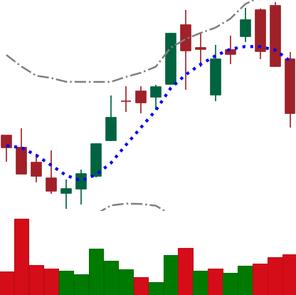
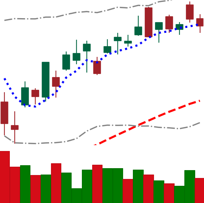
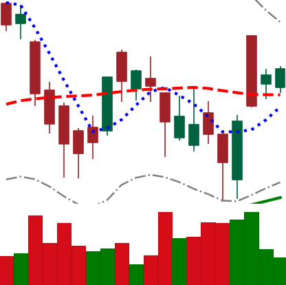
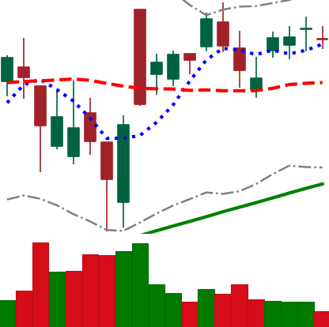

# Chart-Pattern-Dataset

A large-scale candlestick chart image dataset for financial image classification research, covering S&P 500 stocks and major cryptocurrencies.

## Overview

### S&P 500

| Item | Value |
|------|-------|
| **Stocks** | 501 S&P 500 constituents |
| **Total Images** | 1,374,694 |
| **Period** | 2010-01 – 2025-03 |
| **Image Size** | ~480×480 px (4×4 inch, 120 dpi) |
| **Chart Type** | Candlestick (OHLCV) with technical indicators |
| **Labels** | 6-class forward return (±1%/±2%/±3%) |
| **Sectors** | 11 GICS sectors |

### Cryptocurrency

| Item | Value |
|------|-------|
| **Tickers** | 14 (BTC, ETH, BNB, XRP, ADA, DOGE, LTC, LINK, XLM, TRX, ETC, XMR, NEO, EOS) |
| **Total Images** | ~29,000 |
| **Period** | 2017 – 2025 |
| **Image Size** | ~480×480 px (4×4 inch, 120 dpi) |
| **Chart Type** | Candlestick (OHLCV) with technical indicators (same as S&P 500) |
| **Labels** | 6-class forward return (±3%/±5%/±7%, adjusted for crypto volatility) |

## Dataset Access

- **S&P 500 Images + Metadata**: [HuggingFace Datasets](https://huggingface.co/datasets/sogosonnet/SP500-Chart-Dataset)
- **Cryptocurrency Images**: Available in [GitHub Releases](https://github.com/JaehyunAhn/SP500-Chart-Dataset/releases) (`crypto_images.zip`)
- **Code + Documentation**: This repository

## Chart Specification

Each chart image is a 20-trading-day candlestick chart rendered with [mplfinance](https://github.com/matplotlib/mplfinance), including:

- **OHLCV candlestick** bars (Charles style)
- **Volume** bars (bottom panel)
- **MA5** (blue dotted) — 5-day moving average
- **MA60** (red dashed) — 60-day moving average
- **MA120** (green solid) — 120-day moving average
- **Bollinger Bands** (grey dash-dot) — 20-day ± 2σ

All axis labels and ticks are removed to focus on pure visual patterns.

### Sample Images

<p align="center">
  
  
  
  
</p>

## Label Definition

Labels are based on the **5-day forward return** after the chart window:

$$r = \frac{P_{t+5} - P_t}{P_t} \times 100\%$$

### S&P 500 Labels

| Label | Return Range | Description |
|-------|-------------|-------------|
| `down_3plus` | r < −3% | Strong decline |
| `down_2_3` | −3% ≤ r < −2% | Moderate decline |
| `down_1_2` | −2% ≤ r < −1% | Mild decline |
| `up_1_2` | 1% < r ≤ 2% | Mild increase |
| `up_2_3` | 2% < r ≤ 3% | Moderate increase |
| `up_3plus` | r > 3% | Strong increase |

> **Note:** Returns in the range [−1%, +1%] are excluded as ambiguous (flat movements).

### Cryptocurrency Labels

Thresholds are adjusted for higher crypto volatility:

| Label | Return Range | Description |
|-------|-------------|-------------|
| `down_7plus` | r < −7% | Strong decline |
| `down_5_7` | −7% ≤ r < −5% | Moderate decline |
| `down_3_5` | −5% ≤ r < −3% | Mild decline |
| `up_3_5` | 3% < r ≤ 5% | Mild increase |
| `up_5_7` | 5% < r ≤ 7% | Moderate increase |
| `up_7plus` | r > 7% | Strong increase |

> **Note:** Returns in the range [−3%, +3%] are excluded as ambiguous for crypto.

## Directory Structure

### S&P 500

```
images/
├── AAPL/
│   ├── up_3plus/
│   │   ├── AAPL_1003_20140717.png
│   │   └── ...
│   ├── up_2_3/
│   ├── up_1_2/
│   ├── down_1_2/
│   ├── down_2_3/
│   └── down_3plus/
├── MSFT/
│   └── ...
└── ... (501 tickers)

metadata/
├── sp500_constituents.json    # Ticker, company, sector, sub-industry
├── pipeline_summary.json      # Dataset statistics
├── samples_{TICKER}.json      # Per-stock sample metadata
└── progress.json              # Generation progress log
```

### Cryptocurrency

```
crypto_images/
├── BTC-USD/
│   ├── up_7plus/
│   │   ├── BTC-USD_120_20200515.png
│   │   └── ...
│   ├── up_5_7/
│   ├── up_3_5/
│   ├── down_3_5/
│   ├── down_5_7/
│   └── down_7plus/
├── ETH-USD/
│   └── ...
└── ... (14 tickers)

crypto_metadata/
├── samples_{TICKER}.json      # Per-ticker sample metadata
└── crypto_summary.json        # Dataset statistics
```

### File Naming Convention

```
{TICKER}_{INDEX}_{DATE}.png
```
- `TICKER`: Stock symbol (e.g., AAPL)
- `INDEX`: Window start index in the price series
- `DATE`: Last date of the 20-day chart window (YYYYMMDD)

### Metadata Schema (`samples_{TICKER}.json`)

```json
{
  "ticker": "AAPL",
  "n_total": 3070,
  "n_train": 2608,
  "n_test": 462,
  "samples": [
    {
      "index": 120,
      "end_date": "2010-07-15",
      "label": "up_3plus",
      "label_idx": 5,
      "pct_return": 4.2531,
      "ticker": "AAPL"
    }
  ]
}
```

## Sector Distribution

| Sector | Stocks | Samples |
|--------|--------|---------|
| Industrials | 79 | 212,633 |
| Financials | 76 | 208,009 |
| Information Technology | 69 | 195,969 |
| Health Care | 60 | 165,347 |
| Consumer Discretionary | 48 | 137,990 |
| Consumer Staples | 36 | 91,588 |
| Real Estate | 31 | 85,003 |
| Utilities | 31 | 78,933 |
| Materials | 26 | 72,511 |
| Energy | 22 | 64,547 |
| Communication Services | 23 | 62,164 |
| **Total** | **501** | **1,374,694** |

## Temporal Split

For reproducible train/test evaluation, we recommend:

### S&P 500
- **Train**: Samples with `end_date` < 2022-12-21
- **Test**: Samples with `end_date` >= 2023-01-01
- **Embargo**: 10 calendar days between train and test to prevent information leakage

### Cryptocurrency
- **Train**: Samples with `end_date` < 2022-12-21
- **Test**: Samples with `end_date` >= 2023-01-01
- **Embargo**: 10 calendar days between train and test to prevent information leakage

## Usage Example

### Loading with Python

```python
from pathlib import Path
from PIL import Image
import json

# Load metadata
with open('metadata/samples_AAPL.json') as f:
    meta = json.load(f)

# Load a single image
sample = meta['samples'][0]
img_path = Path('images') / sample['ticker'] / sample['label'] / \
    f"{sample['ticker']}_{sample['index']}_{sample['end_date'].replace('-','')}.png"
img = Image.open(img_path)

print(f"Label: {sample['label']}, Return: {sample['pct_return']}%")
```

### Loading with TensorFlow

```python
import tensorflow as tf

def parse_image(path, label, img_size=224):
    img = tf.io.read_file(path)
    img = tf.image.decode_png(img, channels=3)
    img = tf.image.resize(img, [img_size, img_size])
    img = tf.keras.applications.vgg16.preprocess_input(img)
    return img, label

# Build tf.data pipeline
ds = tf.data.Dataset.from_tensor_slices((file_paths, labels))
ds = ds.map(parse_image, num_parallel_calls=tf.data.AUTOTUNE)
ds = ds.batch(64).prefetch(tf.data.AUTOTUNE)
```

## Generation Code

The dataset was generated using the scripts in this repository:

| File | Description |
|------|-------------|
| `Part7_Data_Image_Pipeline.ipynb` | S&P 500 price data download (Colab + Yahoo Finance) |
| `run_part7_local.py` | Parallel image generation (local, multiprocessing) |
| `Part8_CrossSectional_Analysis.ipynb` | Cross-sectional sector analysis experiments |
| `Part9_ViT_Experiment.ipynb` | ViT-B/16 cross-sectional experiments |
| `Part10_Numerical_Baseline.ipynb` | Numerical feature baseline (LR, MLP, LightGBM) |
| `Part11_Crypto_CrossAsset.ipynb` | Cryptocurrency cross-asset generalization experiments |

## Citation

If you use this dataset in your research, please cite:

```bibtex
@misc{sp500chart2025,
  title={SP500-Chart-Dataset: A Large-Scale Candlestick Chart Image Dataset for Financial Image Classification},
  author={Ahn, Jaehyun},
  year={2025},
  howpublished={\url{https://github.com/JaehyunAhn/SP500-Chart-Dataset}},
  note={Yonsei University}
}
```

## License

This dataset is released under the [Creative Commons Attribution 4.0 International License (CC BY 4.0)](https://creativecommons.org/licenses/by/4.0/).

- **Images**: Generated from publicly available Yahoo Finance price data
- **Code**: MIT License

## Acknowledgments

- Price data sourced from [Yahoo Finance](https://finance.yahoo.com/) via [yfinance](https://github.com/ranaroussi/yfinance)
- S&P 500 constituents from [Wikipedia](https://en.wikipedia.org/wiki/List_of_S%26P_500_companies)
- Chart rendering by [mplfinance](https://github.com/matplotlib/mplfinance)
- Research conducted at Yonsei University
